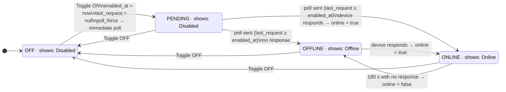

# NetBird Device State Machine

Four internal states. Two of them display as **Disabled**.

## State conditions

| State | `enabled` | `online` | `last_request` vs `enabled_at` | Displayed |
|-------|-----------|----------|-------------------------------|-----------|
| Off | `false` | — | — | **Disabled** |
| Pending | `true` | `false` | `last_request` null or `< enabled_at` | **Disabled** |
| Offline | `true` | `false` | `last_request ≥ enabled_at` | **Offline** |
| Online | `true` | `true` | — | **Online** |

The **Pending** state is transient. With `poll_force`, the daemon fires within 100 ms
and devices respond within 1–5 s, so **Pending → Offline/Online** happens in seconds.

## Polling triggers

| Trigger | Source | Throttled? |
|---------|--------|------------|
| `poll_force` file | Any admin change (toggle, add, edit, delete) | No — bypasses `repeat_seconds` |
| `poll_now` file | `api.php` on page load when data is stale | Yes — once per `repeat_seconds` |
| Periodic | Daemon loop | Every `repeat_seconds` |

The daemon pauses all polling when no browser has fetched `api.php` within 45 seconds.
